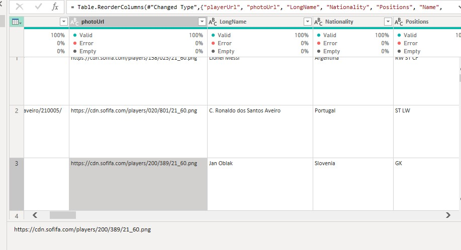
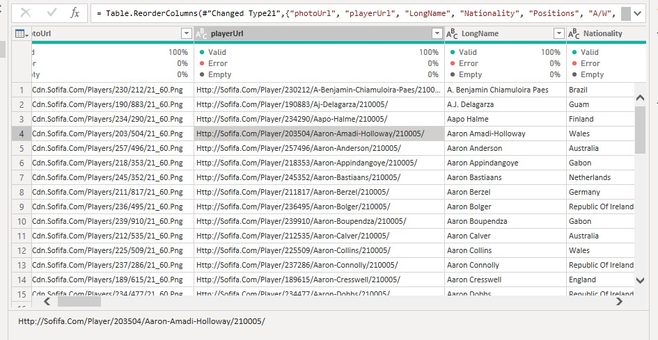
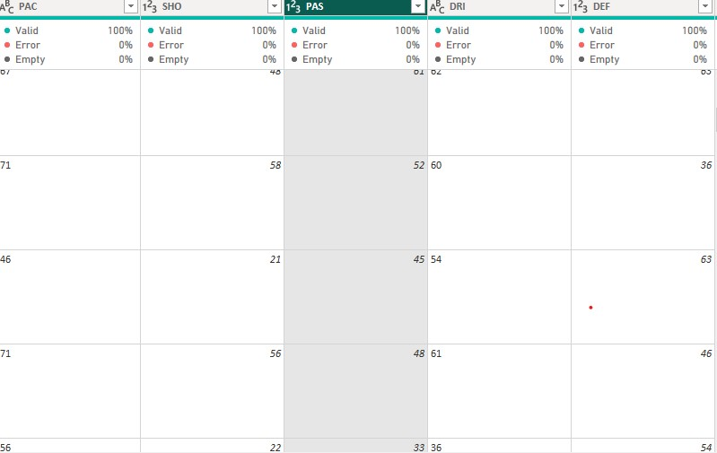
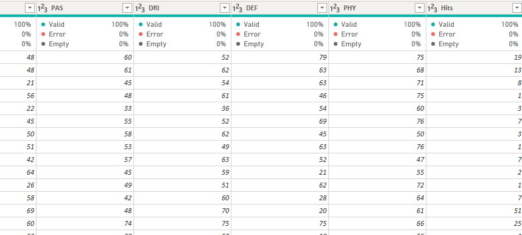
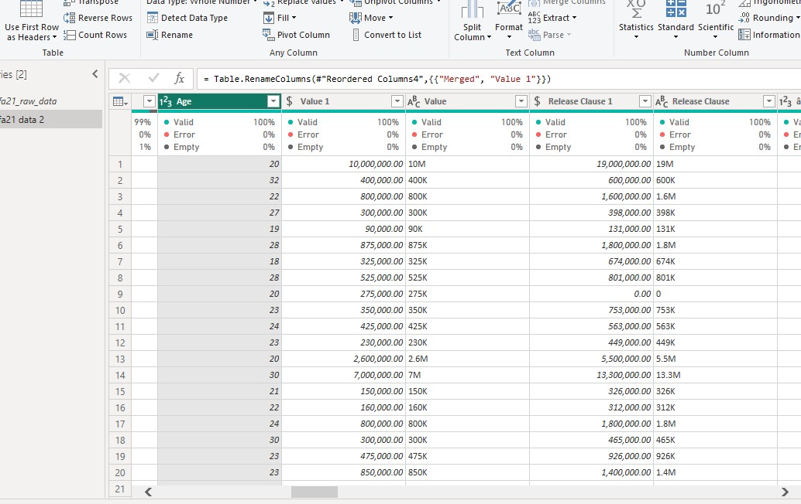
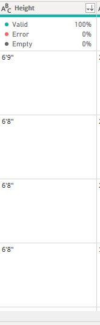
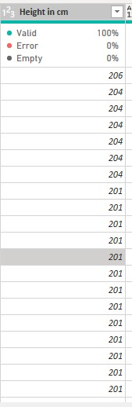
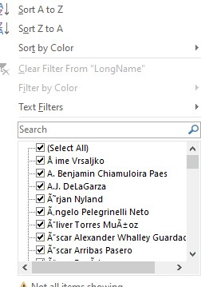
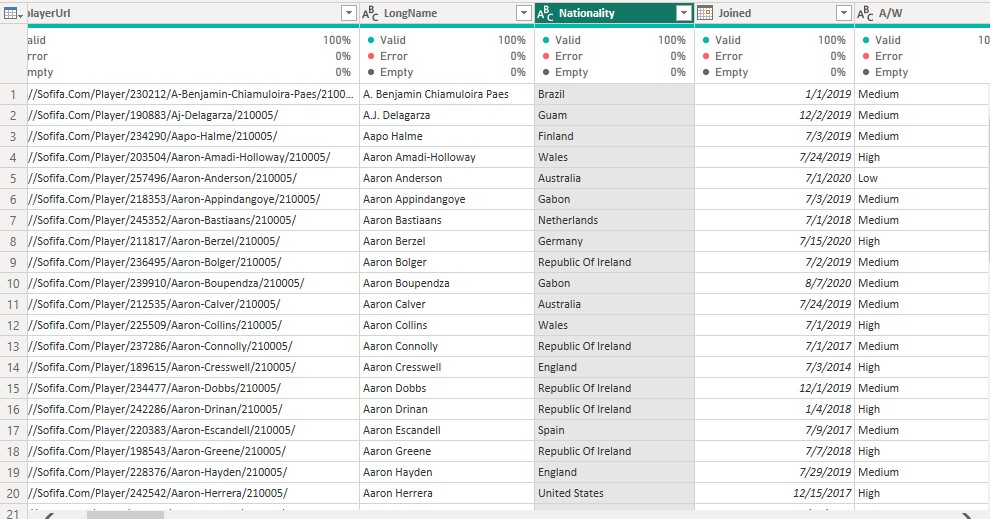

## Data Cleaning: Inspecting, cleaning and transforming the FIFA 21 dataset

Data cleaning is the process of fixing or removing incorrect, corrupted, incorrectly formatted, duplicate, or incomplete data within a dataset.
It is an important part of data analysis that allows data analsyst to have accurate, defensible data that generates reliable visualizations, models, and business decisions

## Introduction

This challenge was hosted by Promise Chinonso to enables participants learn how to clean data with any of the data cleaning tool.
The aim of this project is to exhibit my skills in cleaning/ transforming a rough FIFA 21 dataset and make it ready for analysis.

## Power Query concept applied

- Calculated columns
- Conditional columns
- Split columns
- Reordered columns and sort colums

## Problem Statement

- To clean, trim and change incorrect datatype to appropriate datatype
- To create conditional columns for appropriate columns
- To Replace or fill in missing values
- To remove/replace duplicate entries and null values

## Data Sourcing

This dataset was downloaded from kaggle website. It contains the details of football players alongside their performance, updated up till 2021 and there are 18979 rows and 77 columns present in the FIFA 21 data. see download link [here](https://www.kaggle.com/datasets/yagunnersya/fifa-21-messy-raw-dataset-for-cleaning-exploring)

## Data Transformation/ Cleaning

Data was efficiently cleaned and transformed with power query editor of Power BI. Some the steps taking in cleaning the dataset are:

### Making first row as header in the FIFA dataset table
 Promoting headers is making the top row of a table that acts as a title for the type of information they will find in each column. it makes the dataset more readable and easy to understand
 
 ### Formatting the dataset for better view
 This dataset were roughly presented so i have to highlight the whole dataset, go to the format tab the click on clean and trim to remove unwanted spaces, so the dataset can look presentable
 
 Before Cleaning            |                   After Cleaning
 :-------------------------:|:--------------------------:
     |        
 
 The dataset was downloaded unclean and not well formatted, i have to clean it for better view

### Changed Datatype
Some of the columns datatype were wrongly auto detected by power query which has to be changed to the appropriate datatype
Auto detected               |         Changed datatype
 :-------------------------:|:--------------------------:
  |  
 

### Create a conditional column

 - Value, Release_clause and Wage columns had datatype issues. These columns had suffixes 'M' for millions, 'K' for thousands Created a conditional column to help separate data in values column for k & m as thousand and million
- To uniform the values in these columns (whole number and decimal) the suffixes were replaced with space, data types were converted, and a custom column was created for the multiplication of values in these original columns and the values in the conditional columns. The new columns containing the normalized values were converted to whole number data types and renamed as Values 1, Release_clause 1 and wage 1 respectively

 

- The height and weight column was stored in Text datatype. I had to remove the suffixes from after each value in each of the two columns before I could change the data type to a whole number. To do this, the values in the weight column were changed from lbs to kg and the values in the height column from feets&inches to cm before the unneeded suffixes were removed.

Height in feet(ft)       |         Height in centimeters
 :----------------------:|:-------------------:
        |       
 
 
 - The players Url column contained links to each players profile which was removed from the dataset. The players LongName column contained wrong spellings and symbols which were cleaned, trim and the values were converted to text datatype. Also the Joined date and other columns where converted to the approriate datatype. Nationality column had no missing entries, null values, or data type issues. I considered it okay and moved to the next columns.
 
 Dirty LongName        |      Cleaned LongName and other columns
 :--------------------:|:----------------:
          | 
 
 
 **_Conclusion_** 
 
 As this was my first data cleaning challenge the process was a bit challenging but despite that, i was able to clean and transform the FIFA 21 dataset and ready for analysis. In conclusion, a thorough data cleaning process is crucial to ensure the accuracy and reliability of data analysis. By identifying and addressing errors, inconsistencies, and missing values, we can obtain a clean dataset that represents the true nature of the data.
 
 Thank you for reading :blush:
 
 __You can reach me on__ [Twitter](https://twitter.com/F_deela)
 
